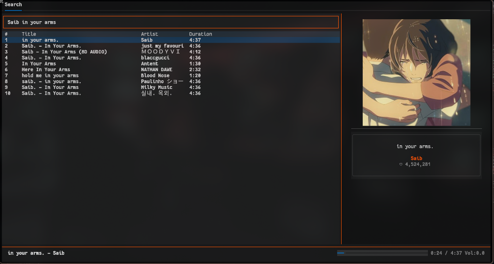

# SoundCloud CLI

A terminal-based SoundCloud player I built because I wanted to listen to music without leaving my terminal. No Electron, no browser tabs — just search, pick a track, and hit play.


---



## Why?

I spend most of my day in the terminal and I got tired of alt-tabbing to a browser every time I wanted to hear something on SoundCloud. I looked around for a CLI player that just works — couldn't really find one that fit what I needed. So I sat down and built my own. It talks to SoundCloud's API, pipes audio through mpv, and the whole interface runs inside [Textual](https://github.com/Textualize/textual).

## What it looks like

Two panels side by side:

- **Left** — search bar at the top, results table below (title, artist, duration)
- **Right** — album art rendered right in the terminal, plus track name, artist, and play count

Bottom of the screen has a now-playing bar with a progress indicator you can actually click to seek, timestamps on the right, and volume. The accent color is SoundCloud's orange (`#ff5500`) throughout, which I think looks pretty clean.

## Features

- **Search** — type something, hit enter, browse results
- **Stream** — plays audio via mpv in the background (no video window)
- **Album art** — grabs the high-res cover and renders it in your terminal with `textual-image`
- **Seekable progress bar** — click on the bar to jump to any point in the track
- **Track info panel** — quick glance at what you're listening to
- **Secure config** — your `client_id` lives in `~/.config/soundcloud_cli/config.json` with `0600` permissions

## Dependencies

You'll need:

- **Python 3.10+**
- **mpv** — does the actual audio playback
- **Textual** — TUI framework
- **textual-image** — terminal image rendering
- **requests** — HTTP calls

Install Python packages:

```bash
pip install textual textual-image requests
```

And mpv:

```bash
# Debian / Ubuntu / Kali
sudo apt install mpv

# Arch
sudo pacman -S mpv

# macOS
brew install mpv
```

## Setup

1. Clone it:

```bash
git clone https://github.com/ShadyVoxx/soundcloud_cli.git
cd soundcloud_cli
```

2. Drop in your SoundCloud `client_id`:

```bash
mkdir -p ~/.config/soundcloud_cli
echo '{"client_id": "YOUR_CLIENT_ID_HERE"}' > ~/.config/soundcloud_cli/config.json
chmod 600 ~/.config/soundcloud_cli/config.json
```

> **How to get a client ID:** Open SoundCloud in your browser, open DevTools → Network tab, play any track, and look at the query params on any API request. You'll see `client_id` right there. Copy it.

3. Run:

```bash
python -m soundcloud_cli.ui
```

## Project structure

```
soundcloud_cli/
├── main.py                  # Quick test entrypoint
├── app.tcss                 # Textual stylesheet (theming & layout)
└── soundcloud_cli/
    ├── __init__.py
    ├── api.py               # SoundCloud API client
    ├── config.py            # Config file management
    ├── helper.py            # Utility functions (truncation, artwork URLs)
    ├── player.py            # mpv wrapper using IPC socket
    ├── ui.py                # Main Textual app
    └── widgets/
        ├── __init__.py
        ├── now_playing_bar.py   # Bottom bar with progress + seek
        ├── search_bar.py
        ├── track_info.py        # Right panel (artwork + metadata)
        └── track_list.py        # Left panel (search + results table)
```

## How it works (briefly)

- `api.py` hits `api-v2.soundcloud.com` to search for tracks and grab progressive stream URLs
- `player.py` spawns mpv with `--no-video` and talks to it over a Unix socket (`--input-ipc-server`) for play, pause, seek, volume — all of that
- `ui.py` is the Textual app that glues everything together, polls playback every second, and passes messages between widgets
- Album art gets cached at `~/.cache/soundcloud_cli/artwork.jpg` and displayed via `textual-image`

## A note on AI usage

I wrote all the logic, architecture, and functionality myself — the API client, mpv IPC communication, widget system, app flow, all of it. I used AI to help with the **styling** side of things (the `.tcss` stylesheet, picking colors, tweaking layout spacing) to make the UI look more polished. Everything under the hood is mine.

## Known limitations

- Only streams tracks that have a progressive format available (most do, but some don't)
- No playlist support yet — single track at a time for now
- SoundCloud occasionally rotates `client_id` values, so yours might expire and you'll have to grab a new one
- No offline mode or track caching

## Contributing

This is still pretty early and there's a lot of room to grow. If you want to help out or have ideas, I'd genuinely appreciate it. Here are some things I'd love to see:

- **Playlist / queue support** — being able to queue up multiple tracks instead of one at a time
- **Keyboard shortcuts** — play/pause, next, previous, volume up/down without touching the mouse
- **Likes & reposts** — integrate with SoundCloud user accounts so you can browse your own library
- **Better error handling** — some edge cases around network failures and missing streams could be smoother
- **Packaging** — turning this into a proper `pip install`-able package

If any of that sounds interesting to you, fork it, open a PR, or just open an issue to discuss. I'm not picky about process — if the code works and makes sense, it's getting merged. Even small stuff like fixing typos in this README or cleaning up code style is welcome.

```bash
# Fork it, clone your fork, make a branch, do your thing
git checkout -b my-feature
# ... make changes ...
git commit -m "add: description of what you did"
git push origin my-feature
# Then open a PR on GitHub
```

No contribution is too small. Seriously.

## License

MIT — use it however you want.

---

*Built because alt-tabbing to a browser for music is a mass productivity killer.*
